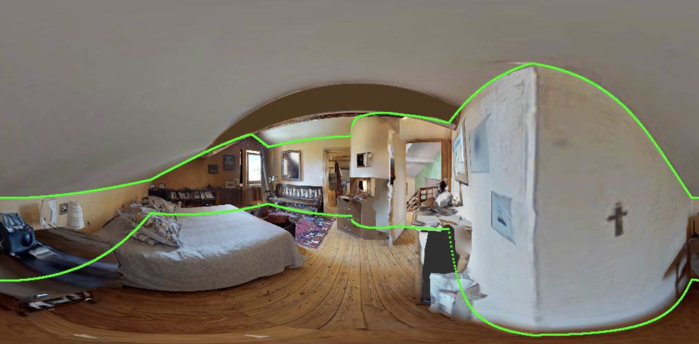
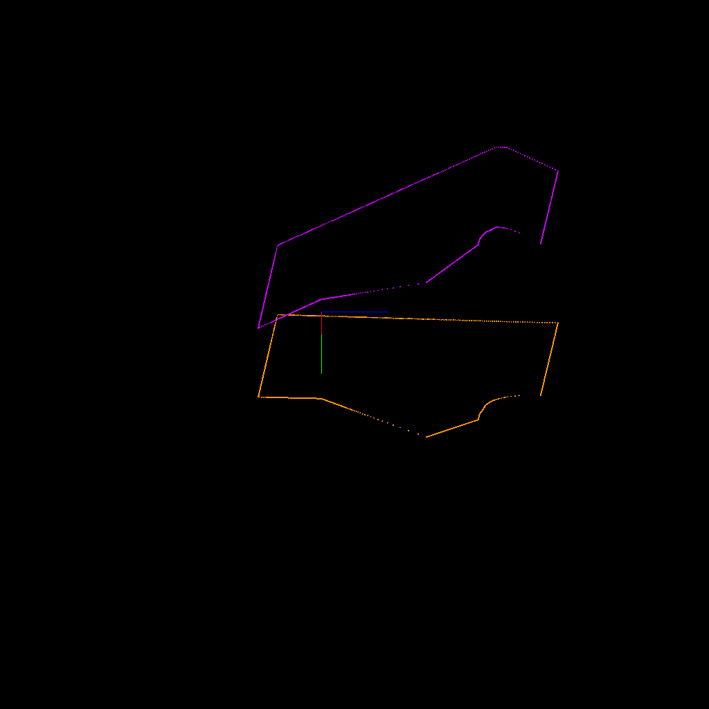

# Multiview Datasets

This repository contains the code for handling several 360-FoV multiview datasets. 
In particular, it contains the following datasets:

<!-- - [ ] [MP3D-VO Dataset](https://github.com/EnriqueSolarte/robust_360_8PA): A dataset of sequence of 360-images for visual odometry task.
- [ ] [MP3D-FPE Dataset](https://github.com/EnriqueSolarte/direct_360_FPE): A dataset for floor plan estimation using multiple 360-images. -->
- [x] [MP3D-FPE-MLV Dataset](https://github.com/EnriqueSolarte/360-mlc): A dataset for multiview layout estimation. Particularly, for self-training 360-layout models.
- [x] [360-HM3D-MLV Dataset](https://github.com/EnriqueSolarte/ray_casting_mlc): A dataset for multiview layout estimation using HM3D dataset.

## Installation

### Create a virtual environment
```sh 
conda create -n mv_datasets python=3.9
conda activate mv_datasets
```

### Install the package from the repository
```sh

# Installing version v1.0.24.11.24
pip install git+https://github.com/EnriqueSolarte/multiview-datasets.git@v1.0.1
```

### For installing this package in dev mode (for development)
```sh 
git clone git@github.com:EnriqueSolarte/multiview-datasets.git
cd multiview-datasets
pip install -e .
```

## Download MLV-Datasets
The mvl-datasets is host in [huggingface/EnriqueSolarte/mvl_datasets](https://huggingface.co/datasets/EnriqueSolarte/mvl_datasets) 🤗. 

> [!WARNING]  
> To access to the mvl-datasets (i.e., hm3d-mvl, mp3d-mvl, and zind-mvl), you need to create an account and login on HuggingFace and accept the terms and conditions described [HERE](https://huggingface.co/datasets/EnriqueSolarte/mvl_datasets). 

After you get access to the datasets, you have to login your account in your system by following the next commands:

```bash
# Install huggingface CLI 
pip install -U "huggingface_hub[cli]"

# Login to your account
huggingface-cli login

# Login to your account
huggingface-cli whoami
```

Ideally, after login you can download the mvl-dataset by executing the next commands: 
```bash

# To download and save the dataset in DIR_DATASET
python examples/download_mvl_data/mvl_datasets.py dir_mvl_dataset=${DIR_DATASET}

# To download mp3d_fpe_mvl, hm3d_mvl, or zind_mvl 
python examples/download_mvl_data/mvl_datasets.py dir_mvl_dataset=${DIR_DATASET} dataset=${DATASET_NAME}

# To use the default OmegaConfig in the examples/download_mvl_data/cfg.yaml 
python examples/download_mvl_data/mvl_datasets.py
```

After you download the dataset, you can visualize and check it as follows: 
```bash

python examples/visualizations/vis_2d_boundaries.py dir_datasets=${DIR_DATASET}

python examples/visualizations/vis_3d_boundaries.py dir_datasets=${DIR_DATASET}

```
vis_2d_boundaries.py             |  vis_3d_boundaries.py
:-------------------------:|:-------------------------:
  |  

> [!NOTE]
> The `mp3d-fpe` is a dataset originally introduced for the task of Floor Plan Estimation in [Direct 360-FPE - RA'L'22](https://github.com/EnriqueSolarte/direct_360_FPE) and used for self-training layout estimation in [360-MLC - NeuriPS'22](https://enriquesolarte.github.io/360-mlc/). The datasets `mp3d-fpe-mvl`, `hm3d-mvl` and `zind-mvl` are the datasets used in [Ray-casting MLC - ECCV'24](https://enriquesolarte.github.io/ray-casting-mlc/). Note that `zind-mvl` is a subset of the [ZInD]((https://github.com/zillow/zind)). Together these datasets  form the  `mvl-datasets` aiming for a unified benchmark for multiview layout estimation. If you use these datasets, please cite them accordingly. 


For the `hm3d_mvl` dataset please cite the following paper:

```bibtex
@article{solarte2024_ray_casting_mlc,
    title   ={Self-training Room Layout Estimation via Geometry-aware Ray-casting}, 
    author  ={Bolivar Solarte and Chin-Hsuan Wu and Jin-Cheng Jhang and Jonathan Lee and Yi-Hsuan Tsai and Min Sun},
    journal ={European Conference on Computer Vision (ECCV)},
    year    ={2024},
    url     ={https://arxiv.org/abs/2407.15041}, 
}
```

For the `mp3d_fpe_mvl` dataset please cite the following papers:
```bibtex
@article{Solarte2022_360_MLC,
    title   ={360-mlc: Multi-view layout consistency for self-training and hyper-parameter tuning},
    author  ={Solarte, Bolivar and Wu, Chin-Hsuan and Liu, Yueh-Cheng and Tsai, Yi-Hsuan and Sun, Min},
    journal ={Advances in Neural Information Processing Systems (NeurIPS)},
    volume  ={35},
    pages   ={6133--6146},
    year    ={2022}
}
```
```bibtex
@article{Solarte2022_DFPE,
  author={Solarte, Bolivar and Liu, Yueh-Cheng and Wu, Chin-Hsuan and Tsai, Yi-Hsuan and Sun, Min},
  journal={IEEE Robotics and Automation Letters}, 
  title={360-DFPE: Leveraging Monocular 360-Layouts for Direct Floor Plan Estimation}, 
  year={2022},
  volume={7},
  number={3},
  pages={6503-6510},
  doi={10.1109/LRA.2022.3173730}}
```

For the `zind-mvl` dataset please cite the following paper:
```bibtex
@inproceedings{ZInD,
  title     = {Zillow Indoor Dataset: Annotated Floor Plans With 360º Panoramas and 3D Room Layouts},
  author    = {Cruz, Steve and Hutchcroft, Will and Li, Yuguang and Khosravan, Naji and Boyadzhiev, Ivaylo and Kang, Sing Bing},
  booktitle = {Proceedings of the IEEE/CVF Conference on Computer Vision and Pattern Recognition (CVPR)},
  month     = {June},
  year      = {2021},
  pages     = {2133--2143}
}
```

